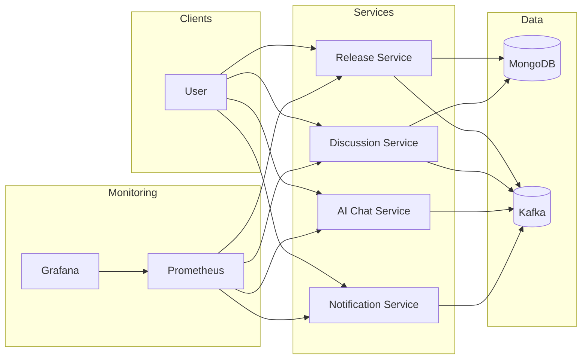

# Architecture

```mermaid
flowchart LR
    subgraph Clients
        user[User]
    end

    subgraph Services
        release[Release Service]
        discussion[Discussion Service]
        ai[AI Chat Service]
        notification[Notification Service]
    end

    subgraph Data
        mongo[(MongoDB)]
        kafka[(Kafka)]
    end

    subgraph Monitoring
        prometheus[Prometheus]
        grafana[Grafana]
    end

    user --> release
    user --> discussion
    user --> ai
    user --> notification

    release --> mongo
    discussion --> mongo
    release --> kafka
    discussion --> kafka
    ai --> kafka
    notification --> kafka

    prometheus --> release
    prometheus --> discussion
    prometheus --> ai
    prometheus --> notification
    grafana --> prometheus
```
