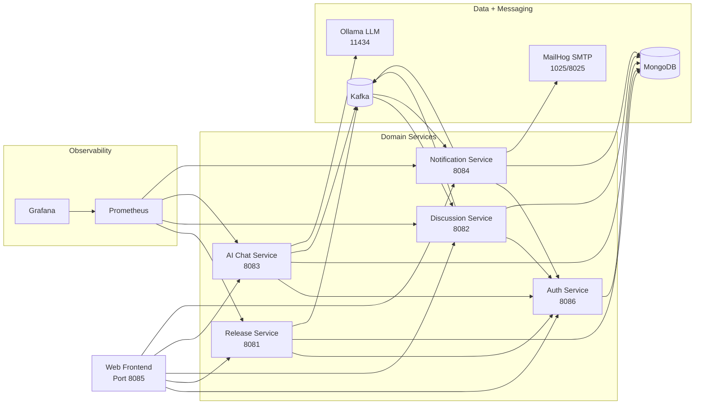
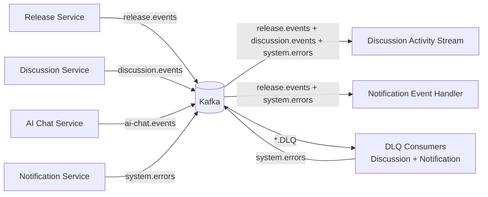

# System Architecture

## 1) Problem Frame
Build a release orchestration platform with:
- Role-based authentication (`ADMIN`, `DEVELOPER`)
- Task lifecycle and ordering controls
- Cross-service activity stream (event-driven)
- AI chat assistant with persisted conversation history
- Notification + DLQ/system-error alerting
- Observability with Prometheus + Grafana

## 2) High-Level Architecture

## 3) Event-Driven Backbone

Core topics:
- `release.events`
- `discussion.events`
- `ai-chat.events`
- `system.errors`
- Dead-letter topics: `release.events.DLQ`, `discussion.events.DLQ`, `system.errors.DLQ`

## 4) Trust and Security Boundary
- JWT issued by `auth-service` (`/auth/login`, `/auth/register`)
- Service-level token validation against `auth-service /auth/validate` (enabled by `AUTH_VALIDATE=true`)
- Role checks via method security (`@PreAuthorize`) on privileged endpoints

## 5) Deployment View (Current)
- Single Docker Compose stack
- Shared Kafka + shared MongoDB server, with logical DB-per-service separation:
  - `auth`
  - `releases`
  - `discussions`
  - `ai-chat`
  - `notifications`

## 6) Non-Functional Notes
- Horizontal scaling candidate services: `release-service`, `discussion-service`, `notification-service`
- Main bottlenecks to watch: Kafka partitioning strategy, Mongo query/index coverage, Ollama response latency
- Observability baseline already wired (`/actuator/prometheus` for core services)

## 7) Related Documents
- Data model: `docs/erd.md`
- Mongo schema details: `docs/schema.md`
- System rationale and outcomes: `docs/final-report.md`
- Event contracts: `docs/event-contracts.md`
