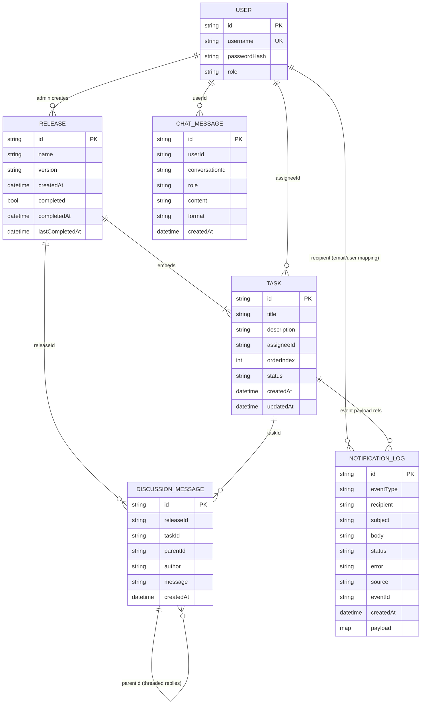

# ERD (Logical)

The platform is MongoDB-based with service-owned data stores. Relationships below are logical (application-level), not database-enforced foreign keys.

## Entity Relationship Diagram

## Notes
- `TASK` is embedded inside the `RELEASE` document in MongoDB.
- `DISCUSSION_MESSAGE.parentId` supports nested reply threads.
- `NOTIFICATION_LOG.payload` stores the original event payload for traceability.
- AI chat conversations are grouped by `conversationId` and ordered by `createdAt`.
